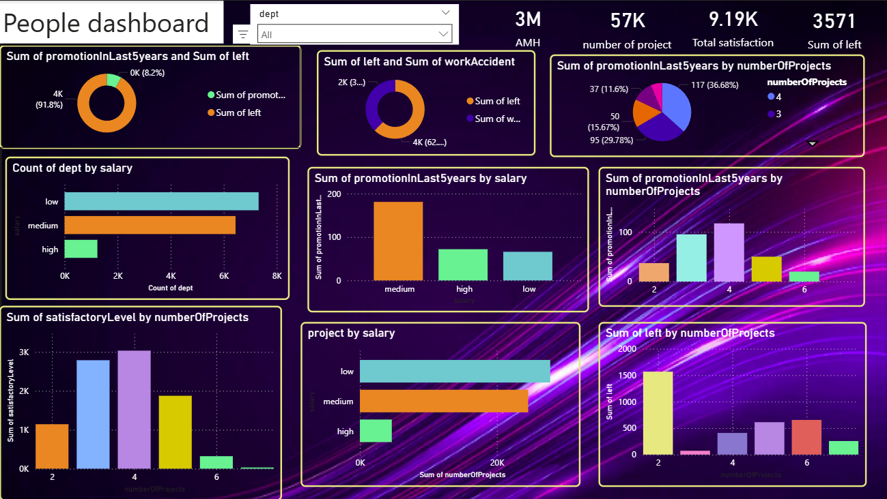

# 👥 People Analytics Dashboard (Power BI)

A visually rich **People Analytics Dashboard** built to analyze **employee performance, satisfaction, promotions, workload, and attrition**.  
This dashboard helps HR teams and decision-makers identify patterns behind **employee retention, promotions, and productivity**.

---

## ✨ Dashboard Highlights

📊 **Key HR Insights at a Glance**
- Total Employees
- Employees Who Left
- Average Satisfaction Level
- Promotions in Last 5 Years
- Projects vs Attrition
- Salary vs Promotion Trends

🎯 Designed for **data-driven HR decisions**

---

## 🖼️ Dashboard Preview

---

## 🔍 Business Questions Answered

✔️ Which **salary group** gets promoted the most?  
✔️ How does **number of projects** impact employee satisfaction?  
✔️ Is **workload** a reason employees leave?  
✔️ Which departments have **higher attrition**?  
✔️ Does **promotion** reduce employee churn?

---

## 📊 Visuals Included

📌 **Donut Charts**
- Promotions vs Employees Who Left  
- Work Accidents vs Attrition  

📌 **Bar Charts**
- Promotions by Salary Level  
- Projects by Salary  
- Attrition by Number of Projects  
- Satisfaction Level by Projects  

📌 **Filters**
- Department slicer for focused analysis  

---

## 🗂️ Dataset Columns Explanation

| Column Name | Description |
|------------|-------------|
| 😊 **satisfactoryLevel** | Employee satisfaction score (0–1) |
| 📈 **lastEvaluation** | Performance evaluation score |
| 🧩 **numberOfProjects** | Total projects handled by the employee |
| ⏱️ **avgMonthlyHours** | Average monthly working hours |
| 🏢 **timeSpent.company** | Years spent in the company |
| ⚠️ **workAccident** | Whether the employee had a work accident (0 = No, 1 = Yes) |
| ❌ **left** | Employee attrition status (0 = Stayed, 1 = Left) |
| 🏆 **promotionInLast5years** | Promotion status in last 5 years (0/1) |
| 🏬 **dept** | Department of the employee |
| 💰 **salary** | Salary category (Low / Medium / High) |

---

## 🛠️ Tools & Technologies

- 🟡 **Power BI** – Dashboard creation & visualization  
- 📁 **CSV Dataset** – Employee data  
- 🧠 **Data Modeling** – Relationships & measures  

---

## 🚀 Key Insights

🔹 Employees with **medium salary** receive the **highest promotions**  
🔹 **High project load** correlates with **higher attrition**  
🔹 **Low satisfaction** strongly indicates employee exit  
🔹 Promotions help reduce churn but are unevenly distributed  

---

## 🎯 Use Cases

✔️ HR Attrition Analysis  
✔️ Promotion & Salary Planning  
✔️ Workforce Optimization  
✔️ Employee Engagement Strategy  

---

## 📌 Future Improvements

🔮 Add **predictive attrition modeling**  
📊 Include **department-wise KPIs**  
🧩 Drill-through pages for individual employees  

---

## 🤝 Connect With Me

👨‍💻 **Prakalp**  
📊 Data Analytics | AI & Data Science  
🔗 GitHub: `Prakalp-74`

---

⭐ *If you like this project, don’t forget to star the repository!*  
